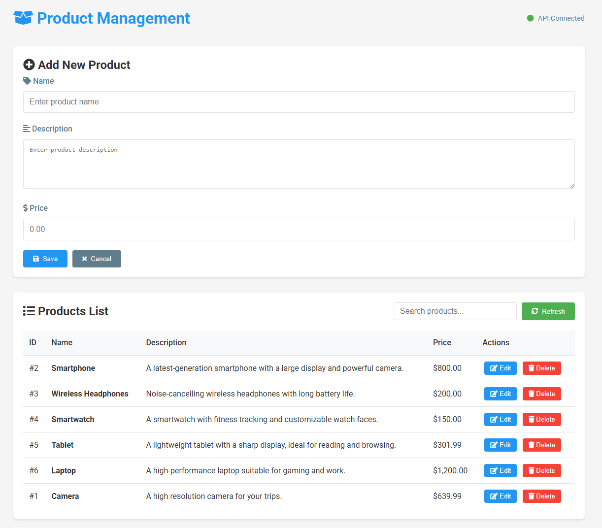

# Rest api using Springboot

This project is a RESTful API built with Spring Boot for managing a product inventory. It includes a web-based frontend for interacting with the API, allowing users to perform CRUD (Create, Read, Update, Delete) operations on products.

## Features

- RESTful API for managing products
- Web-based frontend for interacting with the API
- CRUD operations:
  - Create new products
  - Retrieve all products or a specific product by ID
  - Update existing products
  - Delete products
- Exception handling for invalid requests
- Responsive UI with search and filtering capabilities
- API status indicator on the frontend

## Project Structure

The project follows a standard Maven directory layout:

```
RestApi-SpringBoot/
├── src/
│   ├── main/
│   │   ├── java/
│   │   │   ├── com.api/
│   │   │   │   ├── App.java
│   │   │   │   ├── config/
│   │   │   │   │   └── WebConfig.java
│   │   │   │   ├── controller/
│   │   │   │   │   ├── HomeController.java
│   │   │   │   │   └── ProductController.java
│   │   │   │   ├── exception/
│   │   │   │   │   ├── GlobalExceptionHandler.java
│   │   │   │   │   └── ItemNotFoundException.java
│   │   │   │   ├── model/
│   │   │   │   │   └── Product.java
│   │   │   │   └── service/
│   │   │   │       └── ProductService.java
│   │   ├── resources/
│   │   │   ├── application.properties
│   │   │   └── static/
│   │   │       ├── index.html
│   │   │       ├── script.js
│   │   │       └── style.css
│   ├── test/
│   │   └── java/
│   │       └── com.api/
│   │           └── AppTest.java
├── products.json
├── pom.xml
└── .gitignore
```

## Technologies Used

- **Backend**: Spring Boot
- **Frontend**: HTML, CSS, JavaScript
- **Database**: JSON file (`products.json`) for data storage
- **Build Tool**: Maven

## API Endpoints

### Base URL
`http://localhost:8080/api/items`

### Endpoints
| Method | Endpoint         | Description                     |
|--------|------------------|---------------------------------|
| GET    | `/`              | Serves the frontend application |
| GET    | `/api/items`     | Retrieve all products           |
| GET    | `/api/items/{id}`| Retrieve a product by ID        |
| POST   | `/api/items`     | Create a new product            |
| PUT    | `/api/items/{id}`| Update an existing product      |
| DELETE | `/api/items/{id}`| Delete a product by ID          |

## Frontend Features

- **Dynamic Table**: Displays the list of products with options to edit or delete.
- **Form**: Allows adding or updating products.
- **Search**: Filter products by name or description.
- **API Status Indicator**: Displays the connection status of the API.



## Setup Instructions

### Prerequisites

- Java 8 or higher
- Maven
- A modern web browser

### Steps

1. Clone the repository:
   ```bash
   git clone <repository-url>
   cd RestApi-SpringBoot
   ```
2. Build the project:
    ```bash
    mvn clean install
    ```
3. Run the application:
    ```bash
    mvn spring-boot:run
    ```

4. Open your web browser and navigate to `http://localhost:8080` to access the frontend.

## Database

The application uses a JSON file (`products.json`) for data storage. The initial data in `products.json` is as follows:

```json
[
{
    "id" : "1",
    "name" : "Margherita Pizza",
    "description" : "Traditional pizza with tomato sauce, fresh mozzarella and basil.",
    "price" : 12.99
},
{
    "id" : "2",
    "name" : "Quattro Formaggi Pizza",
    "description" : "A delicious pizza topped with four different cheeses: mozzarella, gorgonzola, parmesan and goat cheese.",
    "price" : 15.50
},
{
    "id" : "3",
    "name" : "Pepperoni Pizza",
    "description" : "Classic pizza loaded with pepperoni, tomato sauce and melted mozzarella.",
    "price" : 14.99
},
{
    "id" : "4",
    "name" : "Vegetarian Pizza",
    "description" : "Fresh vegetable pizza with bell peppers, mushrooms, onions and olives.",
    "price" : 13.99
},
{
    "id" : "5",
    "name" : "Hawaiian Pizza",
    "description" : "Sweet and savory pizza topped with ham, pineapple and double mozzarella.",
    "price" : 14.50
},
{
    "id" : "6",
    "name" : "Seafood Pizza",
    "description" : "A premium pizza with shrimp, mussels, calamari and pesto sauce.",
    "price" : 18.99
}
]
```